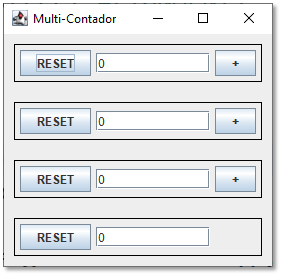
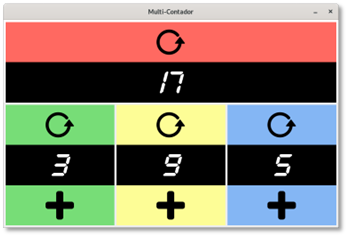

## 1) Ejercicio 1 -	Multicontador
Crea una aplicación que funcione como un contador múltiple. La aplicación presentará la siguiente interfaz gráfica de usuario:

Funcionamiento:
•	Existen cuatro filas de componentes. Cada fila contiene un contador en el centro (cuadro de texto) con botones a ambos lados para su manejo. Los de las tres primeras filas son contadores parciales, el último es el contador global.
•	Cada botón  +  incrementa en una unidad el contador parcial situado a su izquierda.
•	Los botones  RESET  ponen a cero el contador situado a su derecha. El de la última fila también pone a cero los contadores parciales.
•	El contador global muestra en todo momento la suma de los tres contadores parciales.
Propuesta de mejora:
Modifica la interfaz gráfica de usuario para que tenga el aspecto siguiente:

