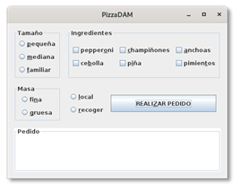
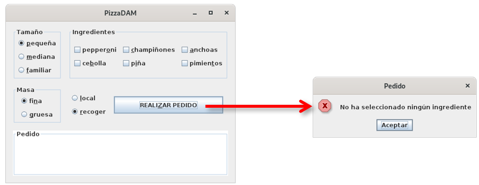
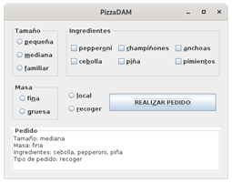

## Ejercicio 2 -	Pizzas
Crea una aplicación para generar pedidos de pizzas. La aplicación presentará la siguiente interfaz gráfica de usuario:

Si se intenta realizar un pedido y hay algún grupo de opciones en el que no se haya hecho una selección se abortará el pedido con un mensaje de error en una ventana emergente:

Después de realizar el pedido, se muestra en sección “Pedido” el resumen del pedido y se borran todas las selecciones:

