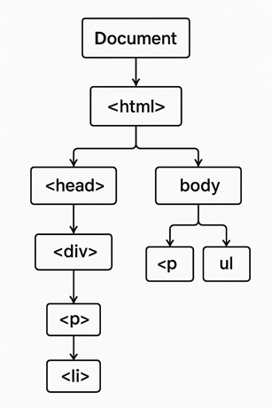

# DOM en JavaScript

El **DOM (Document Object Model)** es una **representación estructurada del contenido HTML** de una página web.  
JavaScript puede **leer, modificar, crear o eliminar** elementos del DOM para cambiar lo que el usuario ve o interactúa. Actúa como un puente entre **HTML** y **JavaScript**.  
Cada etiqueta HTML se convierte en un **nodo** de una estructura jeráquica tipo árbol que JavaScript puede manipular. 
La raiz del árbol es el objeto `document`.


> El DOM permite que JavaScript interactúe con el contenido, el estilo y la estructura de una página web.

---

## 🧩 Ejemplo básico

### HTML:

```html
<!DOCTYPE html>
<html>
  <body>
    <h1 id="titulo">Hola Mundo</h1>
    <button id="boton">Cambiar texto</button>

    <script src="script.js"></script>
  </body>
</html>
```

### JavaScript (`script.js`):

```js
// Acceder al elemento con id "titulo"
let titulo = document.getElementById("titulo");

// Acceder al botón
let boton = document.getElementById("boton");

// Cambiar el texto al hacer clic
boton.addEventListener("click", () => {
  titulo.textContent = "¡Texto cambiado con JavaScript!";
});
```

📤 **Resultado:**  
Cuando el usuario hace clic en el botón, el texto del `<h1>` cambia dinámicamente.

---

## 🔍 Métodos de acceso a elementos del DOM


## 1. `document.getElementById()`
Obtiene **un único elemento** por su atributo `id`.

```html
<p id="mensaje">Hola Mundo</p>
<script>
  const parrafo = document.getElementById("mensaje");
  alert(parrafo.textContent); // "Hola Mundo"
</script>
```

---

## 2. `document.getElementsByClassName()`
Devuelve una **colección (HTMLCollection)** de elementos con la clase indicada.

```html
<p class="nota">Primera nota</p>
<p class="nota">Segunda nota</p>
<script>
  const notas = document.getElementsByClassName("nota");
  alert(notas[0].textContent); // "Primera nota"
</script>
```

---

## 3. `document.getElementsByTagName()`
Devuelve todos los elementos con el nombre de etiqueta especificado (`div`, `p`, `span`, etc.).

```html
<p>Uno</p>
<p>Dos</p>
<script>
  const parrafos = document.getElementsByTagName("p");
  alert(parrafos.length); // 2
</script>
```

---

## 4. `document.querySelector()`
Devuelve **el primer elemento** que coincide con un **selector CSS**.

```html
<div class="contenedor">
  <p class="texto">Hola</p>
</div>
<script>
  const elemento = document.querySelector(".contenedor .texto");
  alert(elemento.textContent); // "Hola"
</script>
```

---

## 5. `document.querySelectorAll()`
Devuelve **todos los elementos** que coincidan con un selector CSS (como un `NodeList`).

```html
<p class="rojo">Texto 1</p>
<p class="rojo">Texto 2</p>
<script>
  const rojos = document.querySelectorAll(".rojo");
  rojos.forEach(p => alert(p.textContent));
  // "Texto 1"
  // "Texto 2"
</script>
```

---

## 6. `element.children`
Devuelve una **HTMLCollection** con los hijos **elemento** del nodo actual.

```html
<ul id="lista">
  <li>Manzana</li>
  <li>Banana</li>
</ul>
<script>
  const frutas = document.getElementById("lista");
  alert(frutas.children[0].textContent); // "Manzana"
</script>
```

---

## 7. `element.firstElementChild` / `element.lastElementChild`
Accede al **primer** o **último** hijo del elemento.

```html
<ul id="clasificacion">
  <li>Primero</li>
  <li>Segundo</li>
  <li>Tercero</li>
</ul>
<script>
  const elemento = document.getElementById("clasificacion");
  alert(elemento.firstElementChild.textContent); // "Primero"
  alert(elemento.lastElementChild.textContent);  // "Tercero"
</script>
```

---

## 8. `element.parentElement`
Obtiene el **elemento padre** del elemento actual.

```html
<div id="padre">
  <p id="hijo">Texto</p>
</div>
<script>
  const hijo = document.getElementById("hijo");
  alert(hijo.parentElement.id); // "padre"
</script>
```

---

## 9. `element.nextElementSibling` / `element.previousElementSibling`
Acceden al **hermano siguiente** o **anterior** del elemento.

```html
<p id="uno">A</p>
<p id="dos">B</p>
<p id="tres">C</p>
<script>
  const elto = document.getElementById("dos");
  alert(elto.previousElementSibling.textContent); // "A"
  alert(elto.nextElementSibling.textContent); // "C"
</script>
```

---

## 10. Colecciones especiales del documento
El objeto `document` también tiene propiedades que devuelven colecciones de elementos específicos:

- `document.forms` → Formularios
- `document.images` → Imágenes
- `document.links` → Enlaces (`<a>`)

```html
<form id="miFormulario"></form>

<a href="#">Enlace</a>
<script>
  alert(document.forms[0].id);  // "miFormulario"
  alert(document.images.length); // 1
  alert(document.links.length);  // 1
</script>
```

---

## 🧩 Resumen Rápido

| Método | Devuelve | Tipo de Selector | Tipo de Resultado |
|:-------|:----------|:----------------|:------------------|
| `getElementById(id)` | Un elemento | ID | Element |
| `getElementsByClassName(class)` | Varios | Clase | HTMLCollection |
| `getElementsByTagName(tag)` | Varios | Etiqueta | HTMLCollection |
| `querySelector(selector)` | Uno | Selector CSS | Element |
| `querySelectorAll(selector)` | Varios | Selector CSS | NodeList |
| `children` | Varios | Hijos directos | HTMLCollection |
| `parentElement` | Uno | Padre | Element |
| `nextElementSibling` | Uno | Hermano siguiente | Element |

---

####  Nota
- `HTMLCollection` y `NodeList` **no son arrays**, pero pueden convertirse con:
  ```js
  Array.from(document.getElementsByTagName("p"))
  ```
- `querySelector` y `querySelectorAll` son los más versátiles y modernos, compatibles con cualquier selector CSS.

---


## ✏️ Modificar contenido
Una vez que se accede al elemento deseado, se podrá modificar su contenido.

```js
// El elemento de id "titulo" puede ser un h1, p, div, ...
const titulo = document.getElementById("titulo");

// Cambiar texto
titulo.textContent = "Nuevo título";

// Cambiar HTML interno (sustituimos "Nuevo título" por la siguiente estructura HTML)
titulo.innerHTML = "<em>Título con énfasis</em>";

// Cambiar estilo
titulo.style.color = "red";
titulo.style.fontSize = "30px";
```

---

## 🧱 Crear, insertar y eliminar elementos

### Crear:
```js
const nuevoParrafo = document.createElement("p");
nuevoParrafo.textContent = "Soy un nuevo párrafo";
```

### Insertar:
```js
document.body.appendChild(nuevoParrafo);
```

### Eliminar:
```js
document.body.removeChild(nuevoParrafo);
```

---

# 🌳 Eventos del DOM en JavaScript

Los **eventos del DOM** son acciones o sucesos que ocurren en el documento (como hacer clic, mover el ratón, escribir en un campo, etc.).  
Puedes **escucharlos** con métodos como:

```js
element.addEventListener("evento", funcion);
```

---

## 🖱️ 1. Eventos del Ratón (Mouse Events)

| Evento | Descripción |
|:--------|:-------------|
| `click` | Se hace clic en un elemento |
| `dblclick` | Doble clic | 
| `mousedown` | Se presiona el botón del ratón | 
| `mouseup` | Se suelta el botón del ratón | 
| `mouseover` | El puntero entra al elemento | 
| `mouseout` | El puntero sale del elemento | 
| `mousemove` | Se mueve el ratón sobre el elemento | 
| `contextmenu` | Se abre el menú contextual (clic derecho) | ("contextmenu", fn)` |

📘 **Ejemplo:**
```html
<button id="btn">Haz clic</button>
<script>
  const boton = document.getElementById("btn");
  boton.addEventListener("click", () => alert("¡Clic detectado!"));
</script>
```

---

## ⌨️ 2. Eventos del Teclado (Keyboard Events)

| Evento | Descripción |
|:--------|:-------------|
| `keydown` | Se presiona una tecla |
| `keyup` | Se suelta una tecla |

📘 **Ejemplo:**
```js
document.addEventListener("keydown", e => {
  alert("Tecla presionada:", e.key);
});
```

---

## 📝 3. Eventos de Formularios (Form Events)

| Evento | Descripción |
|:--------|:-------------|
| `submit` | Se envía un formulario |
| `reset` | Se reinicia un formulario |
| `change` | El valor de un input cambia |
| `input` | Se modifica el valor mientras se escribe |
| `focus` | Un campo obtiene el foco |
| `blur` | Un campo pierde el foco |

📘 **Ejemplo:**
```html
<input id="nombre" type="text" placeholder="Tu nombre">
<script>
  const campo = document.getElementById("nombre");
  campo.addEventListener("input", e => {
    alert("Escribiendo:", e.target.value);
  });
</script>
```

---

## 🌐 4. Eventos de Ventana y Documento

| Evento | Descripción |
|:--------|:-------------|
| `load` | Página completamente cargada |
| `DOMContentLoaded` | El DOM se ha cargado (sin imágenes ni estilos aún) |
| `resize` | Se cambia el tamaño de la ventana |
| `scroll` | Se hace scroll |
| `unload` | Se abandona la página |

📘 **Ejemplo:**
```js
    <script>
        window.addEventListener("DOMContentLoaded", () => {
        alert("El DOM está listo");});

        window.addEventListener("resize", () => {
        alert("Ventana redimensionada");});
    </script>
```

---

## 🧩 5. Eventos de Drag & Drop (Arrastrar y soltar)

| Evento | Descripción |
|:--------|:-------------|
| `dragstart` | Se inicia el arrastre |
| `drag` | Se está arrastrando |
| `dragenter` | El elemento arrastrado entra en un área destino |
| `dragover` | Se arrastra sobre un área destino |
| `dragleave` | Sale del área destino |
| `drop` | Se suelta el elemento arrastrado |
| `dragend` | Finaliza el arrastre |

📘 **Ejemplo:**
```html
  <input id="nombre" type="text" placeholder="Tu nombre">
  <div id="caja" draggable="true">Arrástrame</div>
  <script>
    const caja = document.getElementById("caja");
    const nombre = document.getElementById("nombre");
    caja.addEventListener("dragstart", () => nombre.value="Arrastre iniciado");
  </script>
```

---

## 🎞️ 6. Eventos Multimedia

| Evento | Descripción |
|:--------|:-------------|
| `play` | Se inicia la reproducción |
| `pause` | Se pausa |
| `ended` | Se termina la reproducción |
| `volumechange` | Cambia el volumen |
| `timeupdate` | Se actualiza el tiempo actual de reproducción |

📘 **Ejemplo:**
```html
<video id="vid" src="video.mp4" controls></video>
<script>
  const vid = document.getElementById("vid");
  vid.addEventListener("play", () => alert("Reproduciendo..."));
</script>
```

---

## 📱 7. Eventos de Dispositivos Móviles / Touch

| Evento | Descripción |
|:--------|:-------------|
| `touchstart` | Dedo toca la pantalla |
| `touchmove` | Dedo se mueve |
| `touchend` | Dedo se levanta |
| `touchcancel` | Acción interrumpida |

📘 **Ejemplo:**
```js
document.addEventListener("touchstart", () => console.log("Pantalla tocada"));
```

---

## 🧠 Cómo agregar y quitar eventos

📘 **Agregar:**
```js
element.addEventListener("click", miFuncion);
```

📘 **Quitar:**
```js
element.removeEventListener("click", miFuncion);
```

---

#### 💡 Notas finales
- Los nombres de los eventos **no llevan el prefijo "on"**. Al usar `addEventListener`, por ejemplo, usa `"click"` y no `"onclick"`.
- Puedes usar la misma función para varios eventos si los manejas según `event.type`.
- Algunos eventos (como `scroll` o `mousemove`) pueden ejecutarse muchas veces por segundo, así que conviene **limitarlos** con técnicas como *debounce* o *throttle*.

---

## 🧩 Ejemplo completo

```html
<!DOCTYPE html>
<html>
  <body>
    <h2 id="titulo">Bienvenido</h2>
    <input id="nombre" placeholder="Escribe tu nombre">
    <button id="boton">Saludar</button>

    <script>
      const titulo = document.getElementById("titulo");
      const boton = document.getElementById("boton");
      const nombre = document.getElementById("nombre");

      boton.addEventListener("click", () => {
        titulo.textContent = `¡Hola, ${nombre.value}!`;
      });
    </script>
  </body>
</html>
```

📤 **Resultado:**  
Cuando escribes tu nombre y haces clic en el botón, el título cambia a “¡Hola, [tu nombre]!”

---

## 🧾 En resumen

| Acción | Método / Propiedad |
|--------|--------------------|
| Seleccionar por ID | `getElementById()` |
| Seleccionar con CSS | `querySelector()` / `querySelectorAll()` |
| Cambiar texto | `textContent` / `innerHTML` |
| Cambiar estilo | `.style.propiedad = valor` |
| Crear elemento | `createElement()` |
| Agregar al DOM | `appendChild()` |
| Eliminar elemento | `removeChild()` |
| Escuchar eventos | `addEventListener()` |

---

✅ **Conclusión:**  
El **DOM** es la base de la manipulación dinámica de contenido en JavaScript.  
Permite crear interfaces interactivas, responder a eventos y actualizar el contenido sin recargar la página.
